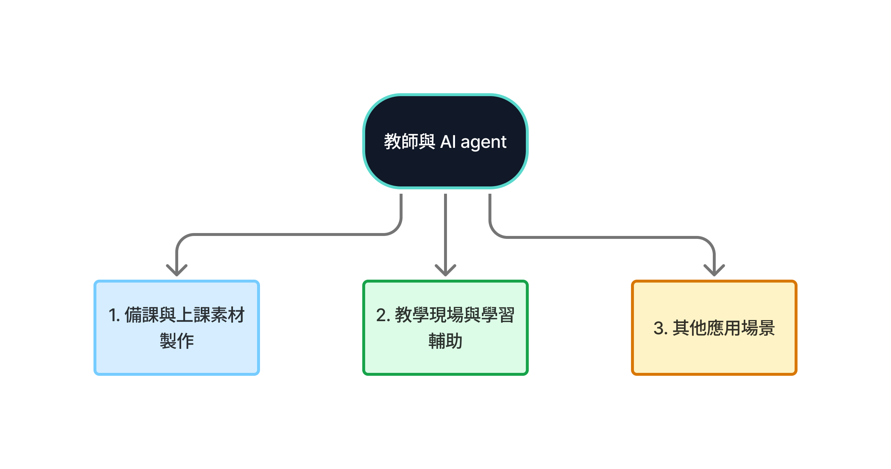
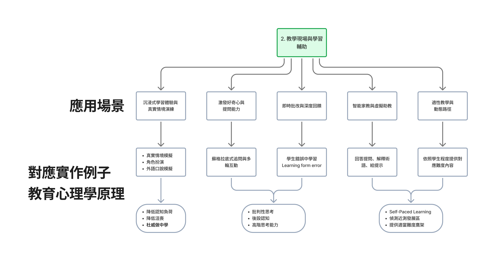

# Для преподавателей — специализированная ветка

> [繁體中文](./for-teacher.md) | [简体中文](./for-teacher.zh-Hans.md) | [English](./for-teacher.en.md) | **Русский**

> 🚀 **Первый раз с AI agents или не писал код?** Начни с [`resources/setup-guide.ru.md` §A-C](../resources/setup-guide.ru.md) (около 30 минут на установку нужного). Tier 0 и Tier 1 кода не требуют — пропускай сначала; Tier 2 и дальше — используют.

> [← Назад к README основного пути](../README.ru.md) · Сюда — после **A3 в Track A** или **этапа 7 в Track B**. Применять agentic AI к teaching workflow.

## Use cases

AI use cases для преподавателей сначала читаются как три ветви: **подготовка уроков и создание материалов**, **поддержка в классе и обучения**, **другие use cases**. Эта группировка следует распространённым AI in Education дискуссиям вокруг администрирования, преподавания и обучения, а также отражает недавнюю работу по generative AI для создания материалов, feedback'а и интерактивной поддержки (Chen et al., 2020; Mittal et al., 2024). Начинай с teacher oversight и границ, потом выбирай ветвь, ближе всего соответствующую твоей teaching need.



### За чем преподавателям следить при использовании AI

AI может готовить и помогать, но не должен заменять teacher judgment. Недавние AI in Education и generative AI for education исследования также подчёркивают ясные learning goals, safety boundaries и human review при дизайне AI-agent'ов преподавателями (Chen et al., 2020; Mittal et al., 2024).

- **Держи teacher judgment в loop**: когда вовлечены student data, оценки или teaching-решения, ответственность за финальный review остаётся за преподавателем.
- **Не давай ответы слишком быстро**: если студенты взаимодействуют с AI agent'ом, спроектируй поток как сократический диалог, чтобы студенты объясняли свои рассуждения за несколько ходов.
- **Согласуй с learning goals**: используй prompts, skills или фиксированные workflow'ы, чтобы ограничить роль и задачу агента — взаимодействие студента остаётся привязанным к уроку.
- **Переписывай вопросы студентов при необходимости**: для младших, например elementary или middle-school, переписывай неясные вопросы перед отправкой агенту.

### Подготовка уроков и создание материалов

Эти workflow'ы помогают учителям готовить материалы. Вывод всё равно должен быть проверен, отобран и просмотрен преподавателем.

- **Генерация lesson plan**: преврати curriculum standards, unit goals и student levels в lesson outline, распределение времени, дизайн активностей, discussion prompts и supplementary guides.
- **Создание quiz / rubric**: генерируй multiple-choice, short-answer, essay вопросы, answer keys и scoring criteria из текстов, разделов учебника или академических статей.
- **Подготовка slide deck, курсовое mapping и multimedia визуализация**: преврати главы учебника или teacher notes в slide outline, структуры handout'ов, weekly sequences, prerequisite knowledge, assessment checkpoints, изображения, 3D-объекты, video scripts, GIF или классные presentation-ассеты.
- **Синтез и анализ student feedback**: суммаризируй ответы студентов, домашние работы или ответы в классе, чтобы выявить общие misconceptions, потребности в remediation и следующие шаги практики.
- **Multilingual перевод и адаптация материалов**: переписывай или переводи материал для разных языков, генерируй text-to-speech ассеты при необходимости.
- **Материалы для интерактивных игр, активностей и virtual simulation сценариев**: готовь обучающие игры, рифмовки, task cards, role cards, scenario text или simulation-фоны; для реального interaction или activity design — следующий раздел про classroom support.

### Поддержка в классе и обучения



Эти workflow'ы помогают студентам понимать, практиковать и взаимодействовать. AI действует скорее как teaching assistant или activity support tool. Заметь: один урок не обязан включать каждый элемент; выбирай моменты, где дизайн с AI agent реально подходит к учебной активности.

- **Иммерсивное обучение и реалистичная практика сценариев**: используй realistic simulation, role-play или speaking practice, чтобы студенты могли репетировать в почти-аутентичных контекстах, снижая cognitive load и нерешительность.
- **Поддержка curiosity и вопросов**: используй сократические follow-up вопросы и multi-turn взаимодействие, чтобы помочь студентам задавать чётче, объяснять рассуждения, развивать критическое мышление и metacognition.
- **Мгновенная оценка и более глубокий feedback**: помогай студентам учиться на ошибках — указывай ошибки, объясняй почему они происходят, предлагай ревизии вместо просто оценки или ответа.
- **Intelligent tutoring и virtual teaching assistants**: отвечай на вопросы, объясняй терминологию, давай подсказки, чтобы студенты получали соответствующую поддержку в классе и за его пределами.
- **Адаптивное преподавание и динамические пути**: давай контент, соответствующий уровню студента, выводи zone of proximal development из learning performance, предлагай подходящие scaffolding или remediation материалы.

### Другие use cases

Эти use cases могут происходить не прямо внутри урока, но они формируют работу учителя, поддержку студентов и работу education-системы.

- **Special education support**: используй speech-to-text, text-to-speech и связанные инструменты, чтобы студенты с разными потребностями могли участвовать в классе.
- **Parent-teacher communication и family learning**: суммаризируй прогресс студента, предлагай home-based follow-up активности.
- **Администрирование и академическая честность**: суммаризируй learning traces, генерируй отчёты, поддерживай plagiarism и cheating-risk проверки.
- **Career и skill-development guidance**: поддерживай career exploration, дизайн training plan, рекомендации по практике слабых мест.
- **Teacher professional development**: суммаризируй методы преподавания, тренды education-technology и research insights.
- **Advanced research и business analysis**: поддерживай literature review, market-trend analysis или business-plan drafting.
- **Privacy-preserving synthetic data**: генерируй анонимизированные synthetic data для research или системного тестирования без прямого раскрытия персональных данных.

### Ссылки

- Chen, L., Chen, P., & Lin, Z. (2020). [Artificial Intelligence in Education: A Review](https://doi.org/10.1109/ACCESS.2020.2988510). *IEEE Access*, 8, 75264-75278.
- Mittal, U., Sai, S., Chamola, V., & Sangwan, D. (2024). [A Comprehensive Review on Generative AI for Education](https://doi.org/10.1109/ACCESS.2024.3468368). *IEEE Access*, 12, 142733-142759.

## Подборка проектов

### Teaching workflow Skills

(Большинство пока не упаковано в skill-marketplace. У этой ветки больше всего места для community-контрибьютов — см. CONTRIBUTING.md.)

### Полезные building blocks

#### [obra/superpowers](https://github.com/obra/superpowers) ⭐⭐⭐⭐
Общие writing / brainstorming skills. Адаптируются под подготовку уроков.

#### [Claude Code](https://github.com/anthropics/claude-code) (с кастомным CLAUDE.md) ⭐⭐⭐⭐⭐
★ 120k+ — хорошая точка старта для учителей. Используй Claude.ai (web) для low-barrier исследования; апгрейдись до Claude Code, когда workflow становится повторяемым.

### Учебные материалы для курсов (для учителей, готовящих занятия)

#### [huggingface/agents-course](https://github.com/huggingface/agents-course) ⭐⭐⭐⭐

| Поле | Значение |
|---|---|
| Stars | ★ 28k+ |
| License | Apache-2.0 |

**Чему учит**: официальный agents curriculum от Hugging Face — notebooks, упражнения, сертификации. Готовый **AI agent teaching artifact**.

**Лучше всего для**: учителей, ведущих «AI agents intro» workshop или класс, желающих готовые материалы для преподавания или адаптации.

**Заметки**: это учит *как строить агентов* — не «AI tutor для студентов».

---

#### [datawhalechina/llm-universe](https://github.com/datawhalechina/llm-universe) ⭐⭐⭐⭐ (китайскоязычный)

| Поле | Значение |
|---|---|
| Language | Chinese (zh-Hans) |
| Stars | ★ 13k+ |
| License | NOASSERTION |

**Чему учит**: китайскоязычный курс Datawhale по разработке LLM-приложений — RAG, agents, упражнения по главам. Готовый шаблон для китайскоязычных учителей при подготовке материалов.

**Лучше всего для**: китайскоязычных учителей, желающих готовую LLM-программу для адаптации к уровню студентов.

**Заметки**: тот же caveat, что у `huggingface/agents-course` — это «учим студентов строить LLM-приложения», не «AI-ассистент для учителя».

---

### Библиотеки промптов

#### [f/awesome-chatgpt-prompts](https://github.com/f/awesome-chatgpt-prompts) ⭐⭐⭐⭐

| Поле | Значение |
|---|---|
| Stars | ★ 161k+ |
| License | NOASSERTION (CC0 / public-domain-style, но без SPDX) |

**Чему учит**: поддерживаемый сообществом мега-каталог промптов — «act as X» шаблоны, покрывающие сотни ролей (учитель, интервьюер, стендап-комик, дебатор, ...). Учителя могут использовать как «примеры написания промптов» для студентов или одалживать конкретные промпты для in-class демо.

**Лучше всего для**: учителей, представляющих «prompt engineering», которым нужны конкретные примеры разных стилей для сравнения.

**Заметки**: качество разное — относись как к sourcebook, не «используй всё как есть».

---

### Чтение

#### [The Effortless Academic — Beginner Guides](https://effortlessacademic.com/claude-code-and-cowork-for-academics-beginner-guide-part-1/)
Multi-part гайд для академиков, осваивающих Claude Code, применим к учителям.

## Workflow'ы для сборки

Это шаблоны — адаптируй под предмет:

- **Lesson plan generator**: промпт с curriculum + темой → outline → слайды → assessment
- **Rubric creation**: образцы student work + learning objective → черновик rubric
- **Personalized feedback**: student submission + rubric → индивидуальный письменный feedback (с human review)
- **Scenario simulation activity**: learning goal + role setup → диалоговый скрипт → классная практика → reflection вопросы
- **Remediation material generator**: типичные ошибки + student level → короткая практика → подсказки → extension challenge

### 3 copy-paste prompt-шаблона

**1. Lesson outline generator** (вставь в Claude.ai):
```
You are a [SUBJECT] teacher. I'm preparing a [DURATION]-minute class for
[GRADE] students on the topic "[TOPIC]". Prior knowledge: [SUMMARY].
Produce:
1. Learning goals (3-4 bullets, use Bloom's taxonomy verbs)
2. Class outline with time allocation
3. 1 in-class activity / discussion prompt
4. 1 follow-up assessment item
Don't introduce content outside the topic I gave.
```

**2. Rubric draft**:
```
I have a [ASSIGNMENT TYPE] for [GRADE] students on [TOPIC].
Learning objectives: [2-3 bullets].
Produce a 4-level rubric (Excellent / Proficient / Developing / Needs work)
with one paragraph per level across 4 dimensions:
content depth / organization / argumentation or calculation / clarity.
Make descriptions concrete and observable, not vague terms like "high quality".
```

**3. Student feedback synthesis**:
```
Below are [N] student submission excerpts:
[PASTE TEXT]

Please:
1. Summarize 3 common strengths across this batch
2. Summarize 3 common weaknesses
3. For the most common weakness, suggest 1-2 things to reinforce next class
Don't write per-student feedback — I'll do that myself.
```

## Privacy + этика (важно)

Учителя, использующие LLM, отличаются от обычных пользователей — **в игре student data**. Жёсткие правила:

- **Не суй студенческие PII в публичные LLM** (имена, ID, контактные данные, оценки). Сначала анонимизируй («Student A / B / C»)
- **AI-помощь ≠ AI-оценивание**: черновик feedback'а / rubric с LLM — ок, но **финальные оценки требуют human judgment** — LLM пока не надёжны в сложном оценивании
- **Раскрой студентам**: если материал класса AI-assisted — раскрой это (аналогично декларации AI-инструментов в статьях). Teaching integrity важна
- **Fact-check**: LLM hallucination-ит цитаты, имена учёных, research data. Domain content **должен быть верифицирован** до класса
- **Авторские права на student work**: не загружай массово студенческие тексты на сторонние сервисы для анализа — риски FERPA / GDPR

Если у твоей школы / институции есть AI policy, **она приоритетнее** этого гайда.

## Tier-рекомендации для учителей

Большинству учителей стоит остаться на **Tier 0 (browser chat)** или **Tier 1 (Claude Desktop)**:

- **Tier 0**: Claude.ai web chat — copy/paste промптов, без установки
  - Хорошо для: эпизодической подготовки уроков, разовых задач, генерации items, написания писем
  - Пример: скопируй lesson-outline промпт выше, заполни тему, запусти
- **Tier 1**: Claude Desktop / [NotebookLM](https://notebooklm.google.com/) — file uploads, история разговора
  - Хорошо для: оценивания / организации данных семестра, course mapping, bulk-импорта PDF reading list'а и запросов к нему
  - Пример: загрузи полный course reading list в NotebookLM; обращайся в течение семестра
- **Tier 2+ (CLI / SDK)**: только если **автоматизируешь повторяющийся поток**
  - Пример: каждую неделю 30 студенческих работ → авто-генерация черновиков feedback'а
  - Non-coder учителя: **попроси school IT или student RA** настроить; ты только используешь вывод

> Как только ты на Tier 2+ — следуй [Track A — CLI Power User](../tracks/cli/A1-cli-intro.ru.md).

## Другие ветки тоже подойдут

Многие учителя — также исследователи / knowledge workers. Эти ветки пересекаются:

- **Также делаешь research** (lit review, paper writing, references) → [Researcher branch](./for-researcher.ru.md)
- **Отчёты / meeting notes / cross-tool интеграции** (Notion, Excel, email) → [Knowledge Worker branch](./for-knowledge-worker.ru.md)
- **Подключи AI к Notion / Obsidian / Lark / и т. д.** → [`resources/mcp-skills-catalog.ru.md`](../resources/mcp-skills-catalog.ru.md)

## Community note

Эта ветка — сейчас самая маленькая курируемая секция. Особенно приветствуются контрибьюты:

- Skills для генерации lesson plan
- Subject-специфичные prompt-библиотеки (промпты учителя литературы, математики, языка...)
- Teacher-специфичные MCP-серверы (интеграции gradebook'ов, LMS-подключения вроде Canvas / Moodle / Google Classroom)
- **Subject + grade-level кейсы** (например, «я использовал AI для преподавания математики в middle school семестр — вот мой workflow»)

См. [CONTRIBUTING.md](../CONTRIBUTING.md).
