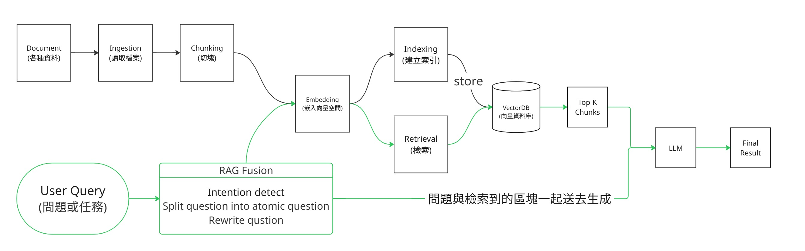
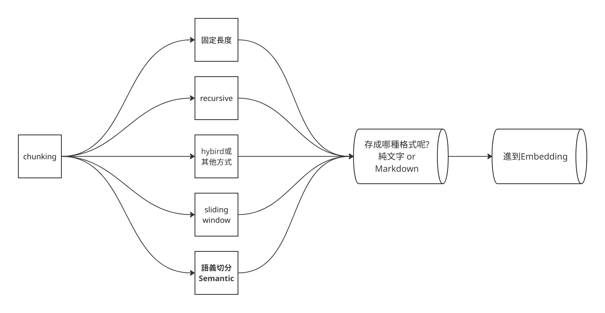

# Этап 6 — Memory · RAG · Advanced

> [繁體中文](./06-memory-rag.md) | [简体中文](./06-memory-rag.zh-Hans.md) | [English](./06-memory-rag.en.md) | **Русский**


⏱ **Оценка времени**: 2 недели (~10 часов)

> 💡 Этап насыщен терминами (**RAG / vector DB / embedding / chunking / hybrid search / reranking / …**) → если что-то незнакомо, сначала проверь [`resources/glossary.ru.md` §3](../resources/glossary.ru.md#3-memory--retrieval--rag).

Агенты, не помнящие прошлые взаимодействия, бесполезны. RAG (Retrieval-Augmented Generation) — стандартный подход. Этот этап покрывает оба.

## 📌 Цели обучения

- Различать short-term, long-term, episodic, semantic memory
- Понимать vector embeddings и similarity search
- Построить базовый RAG-пайплайн (chunk → embed → store → retrieve → generate)
- Распознавать, когда RAG — неправильный ответ (и когда правильный)

## 📚 Обязательное чтение

1. [**LlamaIndex — RAG concepts**](https://docs.llamaindex.ai/en/stable/getting_started/concepts/) — самое чёткое введение
2. [**LangChain — RAG tutorial**](https://python.langchain.com/docs/tutorials/rag/) — hands-on
3. [**Pinecone — Learning Center**](https://www.pinecone.io/learn/) — основы vector DB
4. [**Anthropic — Contextual Retrieval**](https://www.anthropic.com/news/contextual-retrieval) — RAG-техника Anthropic с prompt caching
5. [**LangChain — Text splitters**](https://docs.langchain.com/oss/python/integrations/splitters/index) — введение в стратегии chunking

## 🧭 Гид по разделу

Этап стартует с short-term и long-term memory, потом фокусируется на RAG.

| Сравнение | Short-term memory（短期記憶） | Long-term memory（長期記憶） |
|---|---|---|
| Китайский термин | 短期記憶 | 長期記憶 |
| Источник | Содержание текущего разговора | Информация, сохранённая между сессиями или со временем |
| Длительность | Короткая; обычно ограничена текущей сессией | Длинная; может жить между сессиями |
| Техническая база | context window / prompt | memory store / user profile / vector store |
| Лучше всего для | детали задачи, недавно упомянутый контент | устойчивые предпочтения, долгосрочные цели, background-информация |
| Зависит от длины контекста? | Да — модель видит ограниченное количество за раз | Менее напрямую — контент может жить вне промпта, и только мелкая релевантная часть подтягивается при необходимости |
| Бытовой пример | sms-код, который только что получил, или предыдущая фраза в текущем разговоре | знание, глубоко изученное; библиотека; knowledge base; книги, которые прочёл |

Здесь session означает одно непрерывное взаимодействие — один чат, одна задача, один agent run.

RAG — это как построить библиотеку для агента. Если книги хорошо хранятся и организованы — позже retrieval становится быстрее и точнее.

Базовый RAG flow можно разделить на два пайплайна:

- **Data preprocessing**: ingest → chunk → embed → store (index). Это строит поисковую knowledge base.
- **Retrieval generation**: retrieve → generate. Это находит релевантный контент во время запроса и передаёт LLM для генерации ответа.



RAG Fusion, query rewrite и подобные идеи на диаграмме — продвинутые retrieval-техники. На первом проходе сосредоточься на главном потоке.

Это только минимальный скелет. Дизайн и концептуальные детали раскрыты в секциях ниже.

Читая этот этап, держи в голове два вопроса: Какие use cases плохо подходят для RAG? Какие use cases подходят, но требуют большего, чем базовый RAG?

Это ведёт к более продвинутым RAG-техникам, как GraphRAG. Если любопытно — фокусируйся на том, почему сценарию нужен именно такой RAG-дизайн. Не нужно реализовывать каждую RAG-технику или каждую деталь.

## 🧩 Как думать о chunking

Хороший chunking позволяет LLM генерировать из самой точной и полной информации, помещающейся в ограниченный context window. Это не просто разрезание текста на равные куски. Зависит от приложения и типа документа, и определяет наименьшую семантическую единицу, которую видит retriever.

Хороший chunk делает две вещи одновременно: **достаточно полон**, чтобы модель понимала контекст, и **достаточно сфокусирован**, чтобы retrieval избегал шума. Слишком мелкие chunk'и теряют контекст. Слишком крупные — делают similarity search менее точным.

Распространённые стратегии:

- **Fixed-Length**: разрезание по числу символов или токенов. Просто и стабильно, но достаточно жёстко, чтобы резать через абзацы, предложения или таблицы.
- **Sliding Window**: сохраняй overlap'ы между chunk'ами. Это снижает boundary loss, но увеличивает размер индекса.
- **Recursive**: попробуй сохранить абзацы первыми. Если длина всё равно не помещается — fallback на предложения, слова или меньшие единицы. Хорошая baseline для новичков в RAG.
- **Semantic Chunking**: разрезай по embedding-дистанции или семантическим сдвигам. На практике это значит разрезать, когда текущий chunk и предыдущий становятся семантически разными. Полезно для длинных документов, но дороже и сложнее.
- **Hybrid**: выбирай и комбинируй стратегии в зависимости от приложения и структуры документа. Например, статья может требовать сохранения секций, таблиц, формул и citation-контекста.



Для первого RAG-приложения не стартуй с хитрого splitter'а. Документация LangChain рекомендует стартовать с `RecursiveCharacterTextSplitter` для большинства use case'ов, потом использовать retrieval-результаты, чтобы решить, менять ли стратегию.

```python
from langchain_text_splitters import RecursiveCharacterTextSplitter

text = "This is a long document... (imagine many more words here) ..."

splitter = RecursiveCharacterTextSplitter(
    chunk_size=100,
    chunk_overlap=20,
    length_function=len,
)

chunks = splitter.split_text(text)
print(f"Split into {len(chunks)} chunks")
print(chunks[0])
```

Два быстрых сигнала, что chunking не так:

- Ответ упускает информацию или стартует с середины идеи: chunk'и могут быть слишком мелкие или overlap слишком низкий.
- Ответ содержит правильную информацию плюс нерелевантные детали: chunk'и могут быть слишком крупные или top-k слишком высокий.

Продвинутые вопросы chunking:

- Chunking — не one-time настройка. Тюнь против реальных запросов и кейсов сбоев.
- Chunk size, overlap, top-k и reranking влияют друг на друга. Не смотри только на один параметр.
- Думай о смешанных типах данных: если RAG-источник включает image-heavy PDF и meeting transcripts — как стратегия chunking должна меняться?

## 🛠 Практические упражнения (делать, не просто читать)

### Упражнение 1: Embeddings
Embed'ни 100 предложений, найди nearest neighbors одного query. Построй интуицию, что значит «vector distance».

### Упражнение 2: Vector DB
Сохрани embeddings в Chroma, запрашивай семантически. Сравни с keyword search.

### Упражнение 3: Сравнение chunking
Возьми один документ, раздели тремя способами: fixed-size, по абзацам, heading-aware. Используй 5 реальных вопросов, сравни top-k результаты, заметь, какая стратегия надёжнее находит правильный контекст.

### Упражнение 4: Полный RAG-пайплайн
Chunk PDF → embed → retrieve top-k → generate answer. Базовый скелет, который использует большинство RAG-приложений.

### Упражнение 5: Long-term memory
Дай агенту conversational memory через множество сессий. Используй `mem0` или роли свою на vector store.

## 🎯 Подборка проектов

### [LlamaIndex](https://github.com/run-llama/llama_index)

| Поле | Значение |
|---|---|
| Stars | ★ 49k+ |
| Recommendation | ⭐⭐⭐⭐⭐ |

**Чему учит**: RAG-сфокусированный framework. Document loaders, стратегии chunking, retrieval-паттерны, query engines.

**Лучше всего для**: document-heavy приложений. RAG — его core.

---

### [Chroma](https://github.com/chroma-core/chroma)

| Поле | Значение |
|---|---|
| Stars | ★ 27k+ |
| License | Apache-2.0 |
| Recommendation | ⭐⭐⭐⭐⭐ |

**Чему учит**: open-source embedding database. Запускается локально, без infrastructure setup.

**Лучше всего для**: Упражнения 2 и 4 выше. Самая простая vector DB для старта.

**Запуск**:
```python
import chromadb
client = chromadb.Client()
collection = client.create_collection("hello")
collection.add(documents=["doc 1", "doc 2"], ids=["1", "2"])
results = collection.query(query_texts=["query"], n_results=1)
```

---

### [Qdrant](https://github.com/qdrant/qdrant)

| Поле | Значение |
|---|---|
| Stars | ★ 31k+ |
| Recommendation | ⭐⭐⭐⭐ |

**Чему учит**: production-grade vector DB на Rust. Быстрее Chroma в масштабе.

**Лучше всего для**: когда Chroma не справляется. Есть cloud + self-hosted режимы.

---

### [Weaviate](https://github.com/weaviate/weaviate)

| Поле | Значение |
|---|---|
| Stars | ★ 16k+ |
| Recommendation | ⭐⭐⭐⭐ |

**Чему учит**: vector DB со встроенными модулями (text2vec, generative, classification). Schema-driven.

**Лучше всего для**: production-деплоев, требующих schema-ограничений.

---

### [pgvector](https://github.com/pgvector/pgvector)

| Поле | Значение |
|---|---|
| Stars | ★ 21k+ |
| Recommendation | ⭐⭐⭐⭐ |

**Чему учит**: vector similarity search внутри PostgreSQL. SQL + vector в одной БД.

**Лучше всего для**: команд, уже сидящих на PostgreSQL, не желающих отдельный vector store.

---

### [LangChain — Memory](https://python.langchain.com/docs/concepts/memory/)

**Чему учит**: agent memory паттерны (buffer, summary, vectorstore-backed).

**Лучше всего для**: когда агенту нужно помнить между сессиями.

---

### [mem0ai/mem0](https://github.com/mem0ai/mem0)

| Поле | Значение |
|---|---|
| Stars | ★ 54k+ |
| Recommendation | ⭐⭐⭐⭐ |

**Чему учит**: self-improving memory layer для AI agents. Хранит факты о пользователях между сессиями.

**Лучше всего для**: personal assistant / chatbot-приложений, требующих user-level memory.

---

### [Letta (бывший MemGPT)](https://github.com/letta-ai/letta)

| Поле | Значение |
|---|---|
| Stars | ★ 22k+ |
| Recommendation | ⭐⭐⭐⭐ |

**Чему учит**: long-context agent с иерархической memory. Вдохновлено OS memory management.

**Лучше всего для**: агентов, требующих очень долго живущий контекст (месяцы, не минуты).

---

### [chatchat-space/Langchain-Chatchat](https://github.com/chatchat-space/Langchain-Chatchat)

| Поле | Значение |
|---|---|
| Language | 中文 + Python |
| Stars | ★ 38k+ |
| License | Apache-2.0 |
| Recommendation | ⭐⭐⭐⭐ |

**Чему учит**: самый широко используемый в китайском community framework RAG + Agent-приложений. Offline-deployable knowledge base Q&A с дефолтами, дружелюбными к китайскому. Поддерживает бэкенды ChatGLM / Qwen / Llama / Ollama.

**Лучше всего для**: китайскоязычных учеников, строящих knowledge base / RAG-приложения. Дефолты хорошо обрабатывают китайскую токенизацию + embeddings.

**Заметки**: последний апдейт — ноябрь 2025 (~6 месяцев — на границе active-maintenance критерия).

---

### [Anthropic — Contextual Retrieval cookbook](https://platform.claude.com/cookbook/capabilities-contextual-embeddings-guide)

**Чему учит**: техника contextual retrieval Anthropic с prompt caching, end-to-end пример.

**Лучше всего для**: после базового RAG апгрейдись до contextual retrieval для лучшего recall на длинных документах.

**Заметки**: Anthropic переименовал `anthropic-cookbook` → `claude-cookbooks` в 2025. Hosted notebook выше — канонический референс; сырые GitHub-пути могут смещаться.

---

### [infiniflow/ragflow](https://github.com/infiniflow/ragflow)

| Поле | Значение |
|---|---|
| Language | Python |
| Stars | ★ 79k+ |
| License | Apache-2.0 |
| Recommendation | ⭐⭐⭐⭐⭐ |

**Чему учит**: production-grade RAG engine — глубокое понимание документов (layout, tables, OCR) + hybrid retrieval + agent loop. Референс «**от нуля до задеплоенного RAG-сервиса**».

**Лучше всего для**: поставки RAG не-разработчикам. Гораздо полнее LangChain RAG, но и сложнее.

**Заметки**: open-source RAG engine (self-hostable через Docker или из source). Cloud demo только для оценки — сам проект поставляется как deployable software.

---

### [HKUDS/LightRAG](https://github.com/HKUDS/LightRAG)

| Поле | Значение |
|---|---|
| Language | Python |
| Stars | ★ 34k+ |
| License | MIT |
| Recommendation | ⭐⭐⭐⭐ |

**Чему учит**: graph + vector hybrid retrieval с summarization-based long-context memory. EMNLP 2025 paper-backed.

**Лучше всего для**: всех, изучающих «**как помнить длинные документы / длинный контекст**» с research-grade методами. Дополняет mem0 / Letta (которые ближе к conversational memory).

**Заметки**: research-flavoured кодовая база, менее отполирована, чем ragflow. Хорошо для изучения концепций.

---

### [patchy631/ai-engineering-hub](https://github.com/patchy631/ai-engineering-hub)

| Поле | Значение |
|---|---|
| Language | Python / Jupyter |
| Stars | ★ 34k+ |
| License | MIT |
| Recommendation | ⭐⭐⭐⭐ |

**Чему учит**: коллекция туториалов LLM / RAG / agent по темам — один notebook на тему, от базового RAG до agent-приложений.

**Лучше всего для**: учеников, желающих «ту же концепцию, реализованную разными способами» для сравнения. Cross-stage материал; помещён в этап 6, потому что RAG-темы доминируют.

---

## ✅ Самопроверка перед этапом 7

Можешь:
- [ ] Построить 50-строчный RAG-пайплайн (load → chunk → embed → store → query → answer)
- [ ] Объяснить, почему наивный chunking падает на длинных документах
- [ ] Спроектировать разные стратегии chunking для API docs, PDF и таблиц
- [ ] Выбрать между Chroma, Qdrant, pgvector для заданного масштаба
- [ ] Различать «дай агенту memory» от «используй RAG»

Если да → переходи к [Этапу 7 — Multi-Agent · Production](07-multi-agent-production.ru.md).
